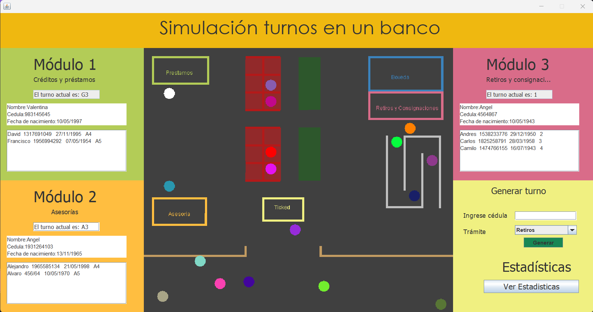

# Bank-Customer-Simulation

## Table of Contents
1. [Introduction](#introduction)
2. [Features](#features)
3. [System Requirements](#system-requirements)
4. [Installation and Usage](#installation-and-usage)
5. [Simulation Logic](#simulation-logic)
6. [Process Simulation](#process-simulation)
7. [License](#license)

## Introduction

<picture> </picture>

This project is a basic simulation of customer service processes in a banking environment. Developed as an academic exercise, it strengthens knowledge in threads and multiprocessing.

The simulation includes:
- Pedestrians passing by outside the bank.
- Customers entering the bank, interacting with service modules, and leaving.
- Automatic UI updates to reflect real-time events.

## Features
- **Thread Management**: Independent threads control customer generation, movement, and module interactions.
- **Dynamic Updates**: A graphical interface automatically updates without user interaction.
- **Customer Simulation**: Includes randomized names, birthdates, and module assignment.
- **Bank Module Interaction**: Simulates ticketing, queues, and service at withdrawal, loan, and advisory modules.
- **Realistic Movement**: Customers follow specific paths and behaviors.

## System Requirements
- **Java SDK**: Version 17 or higher.
- **IDE Options**: IntelliJ IDEA, Eclipse, or NetBeans.
- **Persistence**: Text files for temporary storage (automatically managed).

## Installation and Usage
1. Clone the repository to your local machine.
   ```bash
   git clone https://github.com/Daga321/Bank-Customer-Simulation.git
   ```
2. Open the project in your preferred IDE.
3. Compile and run `Runner.java` in the `Execution` package.
4. Alternatively, navigate to the `src/Execution` directory and run:
   ```bash
   java Runner.java
   ```

## Simulation Logic
The core of the simulation lies in the interaction between threads and modules:

### Pedestrian Generation
Pedestrians are created by the `RunnableGeneratePasserby` thread, which limits their number on-screen to 8. These pedestrians:
- Are assigned random colors.
- Move from one side of the screen to the other.
- Can have erratic movement if marked as "crazy" with a 6% probability.

### Customer Generation
The `RunnableGeneratePerson` thread handles customer creation:
- Operates automatically for the first minute, then switches to manual generation.
- Ensures no more than 18 customers are present at once.
- Randomly assigns names, colors, and birthdates.
- Directs customers to the module with the shortest queue (max 6 per queue).

### Customer Movement
The `RunablePersonMovement` thread controls each customer:
- Starts at a designated entry point and moves towards the center of the screen.
- Adjusts movement based on the assigned module:
  - **Withdrawal Module**: Customers follow a zigzag path respecting queue order.
  - **Loan and Advisory Modules**: Customers move directly to waiting chairs.
- Pauses for ticket retrieval (for loans/advisory) or proceeds directly to service (for withdrawals).
- Once served, the customer exits the bank, ensuring:
  - Proper removal from queues.
  - Exception handling (e.g., early exit on error).

### UI Threads
Two threads ensure the interface updates in real-time:
- **RunnableRepaintPerson**: Handles repainting of customer movements.
- **RunnableUpdateTurns**: Updates module turn information.

Both threads rely on data persistence via TXT files to manage graphical updates.

## Process Simulation
A detailed video walkthrough of the simulation, showcasing:
- Pedestrian behavior.
- Customer interactions with service modules.
- Dynamic updates to the graphical interface.


## License
This project is shared under an open-source license. Feel free to use and modify it for educational or personal purposes.
